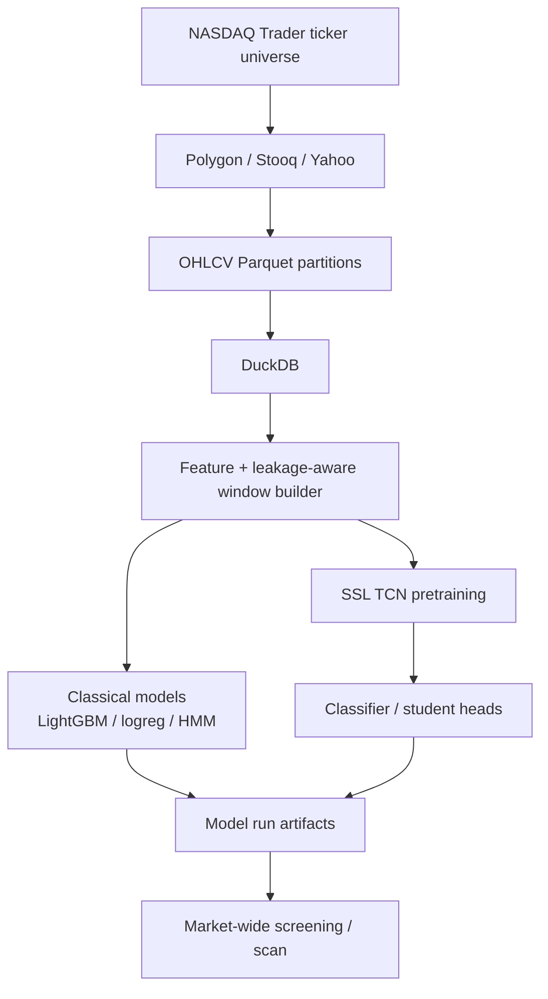

# Nuanced Screener

[](https://github.com/Andrew50/nuanced-screener/actions/workflows/ci.yml)

Local-first market-data and ML screening pipeline for identifying chart-shape setups across a broad US equity universe. It stores OHLCV history in Parquet, uses DuckDB for analytical scans, and trains leakage-aware models using the same decision-time window semantics used during inference.

## Overview

The project explores whether visually defined trading setups can be detected across a large equity universe without lookahead leakage or a persistent database service.

Vendors write local Parquet partitions. DuckDB reads those files for market-wide screens and feature construction. On top of that path sit self-supervised TCN pretraining, classical baselines (logistic regression, LightGBM, HMM regimes), weak-supervision helpers for expanding labels, and reproducible run artifacts under `data/models/`.

**Stack:** Python 3.10+, DuckDB, Parquet/PyArrow, Typer, optional PyTorch / LightGBM / scikit-learn / hmmlearn

## Highlights

- Leakage-aware windows via `WindowedBuildSpec.mask_current_day_to_open_only` (decision at day-open; only `open` retained on the as-of bar)
- Shared window builder for training and inference so information regimes stay aligned
- Parquet-backed local storage with DuckDB named queries (`ns query`)
- Swappable OHLCV vendors: Polygon grouped-daily (default), Stooq, Yahoo Finance
- HTTP retries and per-host rate limiting
- Masked TCN self-supervised pretrain → classifier finetune
- Classical Stack-6 path: logistic regression, LightGBM, HMM regime scoring
- Weak supervision: labeling functions + independent label model → pseudo-labels
- Experiment manifests and `ns models index` over `data/models/<model>/<setup>/<run_id>/`

## Architecture



## Modeling and leakage prevention

Inference is modeled as a decision at a specific market time (typically the open on an as-of date).

When `mask_current_day_to_open_only=True` (the default for supervised window builds), the window builder keeps `open` on the decision-day bar and masks same-day `high` / `low` / `close` / volume fields so those values cannot enter the model. Completed prior bars remain available.

Train and scan paths build windows through the same helpers (`build_windowed_bars` / related batch builders), so training does not silently use a richer information regime than inference. SSL pretraining may use uncensored windows with optional last-timestep censor augmentation to approximate the open-only regime; finetune uses the masked builder.

This is a pipeline convention enforced in code—not a formal proof against every possible leakage source (for example, label timing or feature definitions still need careful review).

## Data and labels

**Tracked**

- `data/meta/tickers.csv` (+ `tickers.meta.json`): NASDAQ Trader Symbol Directory snapshot (NASDAQ / NYSE / AMEX; test issues excluded by default)
- `labels.csv`: hand-labeled setup examples for supervised experiments
- Source, tests, and configuration

**Generated locally (gitignored)**

- `data/raw/`, `data/raw_by_date/`: OHLCV Parquet
- `data/derived/`: last-N bars, candidates, weak-supervision outputs
- `data/models/`: training and pretrain artifacts
- `data/labels/`, `data/patterns/`: generated stores
- Scratch / smoke dirs (`_tmp*`, `._tmp*`)

See [docs/LABELS.md](docs/LABELS.md) for column definitions and setup-code notes.

## Running locally

```bash
python -m venv .venv
source .venv/bin/activate
pip install -e ".[dev]"
cp .env.example .env   # set POLYGON_API_KEY when using Polygon
```

Optional: `pip install -e ".[ml]"` (PyTorch), `pip install -e ".[ml_classic]"` (LightGBM / sklearn / hmmlearn), `pip install -e ".[ui]"` (Streamlit setup builder + vision results), `pip install -e ".[vision]"` (OpenAI + matplotlib for headless chart scans).

```bash
ns --help
ns universe --exclude-test-issues --include-exchanges NASDAQ NYSE AMEX
ns update --ohlcv-vendor polygon_grouped --lookback-years 2 --calls-per-minute 5
ns rebuild-last100 --window-size 100
ns screen --dry-run
ns query --query top_momentum_21d --limit 50
```

Classical train / scan (needs local OHLCV for labeled tickers):

```bash
pip install -e ".[dev,ml_classic]"
ns models train --labels-csv labels.csv --model-type lgbm_stack6 --setup F --window-size 96
ns models scan --model-type lgbm_stack6 --run-dir data/models/lgbm_stack6/F/<RUN_ID> --limit 50
```

SSL pretrain / finetune:

```bash
pip install -e ".[dev,ml]"
ns models pretrain --ticker-source universe --num-samples 50000 --window-max 96 --epochs 5 --device cpu
ns models train --labels-csv labels.csv --model-type ssl_tcn_classifier --setup F \
  --window-size 96 --encoder-dir data/models/ssl_tcn_masked_pretrain/_pretrain/<RUN_ID>
```

Use `ns models --help`, `ns candidates --help`, `ns weak --help`, `ns setups --help`, `ns screen --help`, and `ns vision --help` for the full surface. `--setup` filters must match values present in `labels.csv` (for example `F`), not the separate heuristic names used by weak-supervision helpers.

`ns screen` is the LLM chart-setup pipeline (alias: `ns vision scan`). Live screens auto-run `ns update` when `data/meta/update_state.json` is missing or older than 24 hours (`--skip-update` to disable). `ns models scan` remains the trained-model scorer. Named DuckDB queries are `ns query`.

Vision chart classification (YAML setups → last-N charts → optional Responses API) is documented in [docs/VISION_MVP.md](docs/VISION_MVP.md). `ns setups ui` and `ns vision view` share one Streamlit app (builder vs Results). Results can launch an explicit capped scan (dry-run / demo / live); the list live-updates as batches commit. Storage is `data/vision_scans/`. Live scans need `OPENAI_API_KEY` and `NS_VISION_MODEL`; a missing key does not invent results.

## Testing

```bash
pip install -e ".[dev]"
ruff check .
pytest -q
```

CI runs Ruff and pytest on Python 3.10 and 3.12 without Polygon credentials, GPU, optional ML extras, or OpenAI. The `ui` extra is installed in CI so Streamlit/matplotlib tests run. Smoke tests that need Torch or LightGBM are skipped unless those extras are installed.

## Documentation

- [docs/LABELS.md](docs/LABELS.md) — label schema and setup identifiers
- [docs/SSL_RESEARCH_NOTES.md](docs/SSL_RESEARCH_NOTES.md) — current SSL approach, constraints, candidate objectives
- [docs/VISION_MVP.md](docs/VISION_MVP.md) — chart vision scan install, freshness, CLI, and deferred features
- [docs/VISION_CONTRACT.md](docs/VISION_CONTRACT.md) — frozen vision pipeline contracts

## Project status

Personal research / engineering toolkit: local data + ML screening, not a hosted product. No license file is included (owner decision). Model evaluation metrics are intentionally omitted from this README until published separately.
